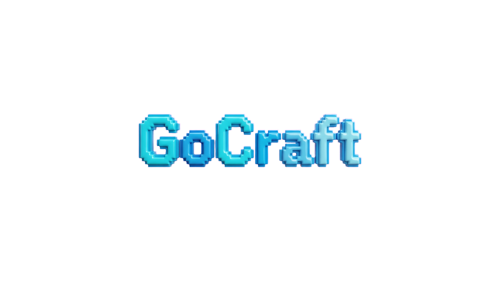

# GoCraft



[English](README.md) | [中文](README_zh.md)

**GoCraft** 是一个使用 Go 语言编写的高性能体素游戏引擎，基于 [raylib-go](https://github.com/gen2brain/raylib-go) 渲染。它具有程序化地形生成、高效的区块管理和多人联机支持。


## 特性

- **高效体素引擎**:
  - 基于区块的渲染与网格池化。
  - 贪婪网格优化（环境光遮蔽 AO，面剔除）。
  - 特殊渲染逻辑：无缝的冰/水表面，以及细节丰富的玻璃/树叶。
- **多人联机支持**:
  - 权威 TCP 服务器/客户端架构。
  - 实体插值与同步。
  - 动态区块加载/卸载。
- **程序化世界**:
  - 使用单纯形噪声（Simplex noise）生成无限地形。
  - 具有平滑颜色过渡的生物群系系统（草地，水域）。
  - 洞穴生成与矿脉。
- **高级光照**:
  - 平滑环境光遮蔽（AO）。
  - 天光传播与日夜循环。

## 快速开始

### 前置要求

- [Go](https://go.dev/dl/) 1.20 或更高版本。
- 需要 C 编译器（GCC/MinGW）以支持 cgo（raylib 依赖）。

### 运行游戏

1. **克隆仓库:**
   ```bash
   git clone https://github.com/yourusername/gocraft.git
   cd gocraft
   ```

2. **运行客户端（单人模式/默认）:**
   ```bash
   go run .
   ```

   **关于材质包**: 
   本仓库不包含有版权的游戏资源。默认情况下游戏将使用占位符（棋盘格）运行。如需使用材质包：
   1. 在游戏目录下找到或新建 `textures/` 文件夹。
   2. 您可以使用标准的 Minecraft 材质包（推荐 Java 版 1.20+）。
   3. 打开材质包 `.zip` 文件，进入 `assets/minecraft/textures/` 目录。
   4. 将里面的内容（`block`, `item` 等文件夹）解压到你的本地 `textures/` 文件夹中。
   
   *免责声明：请确保您拥有使用导入游戏的任何材质包或资源的合法权利。*

### 多人联机

启动专用服务器:
```bash
go run . -server
```

以特定用户名加入（客户端）:
```bash
go run . -name PlayerName
```

## 操作说明

- **W, A, S, D**: 移动
- **空格 (Space)**: 跳跃 / 向上飞行
- **左 Ctrl**: 向下飞行
- **F**: 切换飞行模式
- **左键**: 破坏方块
- **右键**: 放置方块
- **1-9**: 选择快捷栏方块
- **E**: 打开背包 (开发中)
- **F3**: 切换调试信息

## 许可证

本项目采用 GNU 通用公共许可证 v3.0 (GPLv3) 授权 - 详情请参阅 [LICENSE](LICENSE) 文件。

### 第三方许可证

- **Raylib**: 采用 zlib 许可证授权。详情请参阅 [LICENSE_raylib.txt](LICENSE_raylib.txt)。
